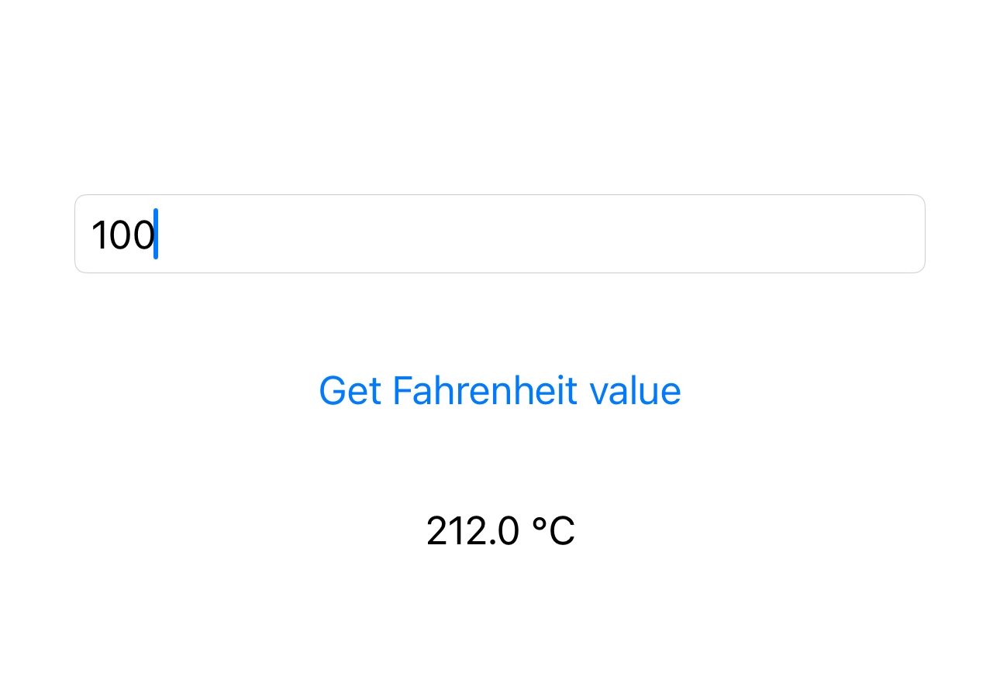

# Simple Project to Demonstrate TensorFlow to CoreML Conversion 
In this project, I have used sequential model to keep this simple. I have added comment to the code so that anyone can understand the process. 
In iOS project, I have load the model and predict value from input. Here is the output: 

