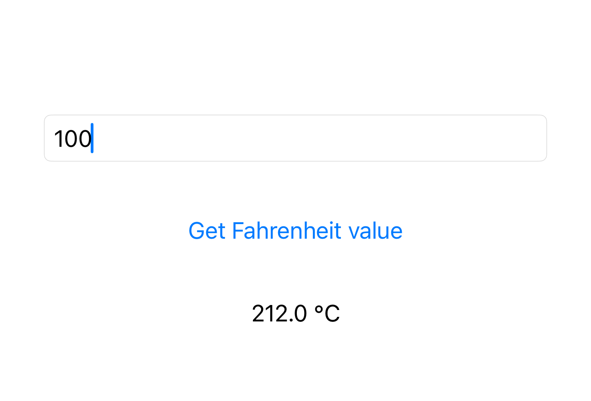

# Simple Project to Demonstrate TensorFlow to CoreML Conversion 
In this project, I have used sequential model to keep this simple. I have added comment to the code so that anyone can understand the process. 
In iOS project, I have load the model and predict value from input. 
Here is the output: 

বাংলাতেও প্রজেক্ট সম্পর্কে বিস্তারিত জানা যাবে। [টেনসরফ্লো মডেলকে CoreML এ কনভার্ট করে iOS অ্যাপে ব্যবহার ](https://jakir.me/tensorflow-to-coreml/)
